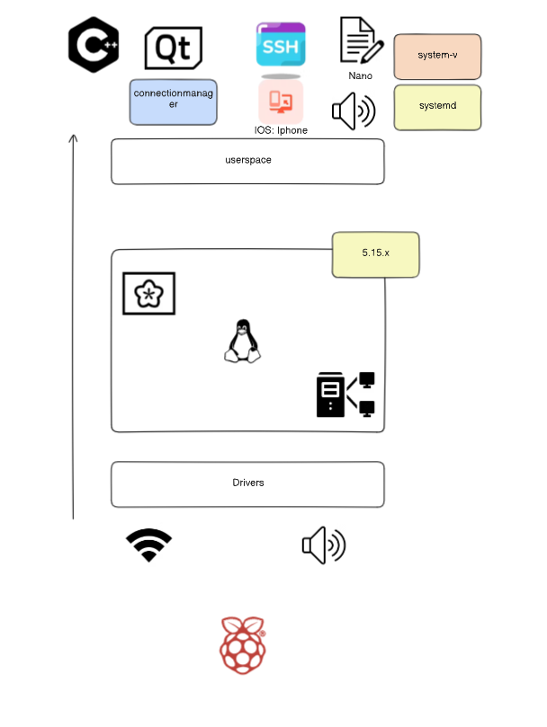
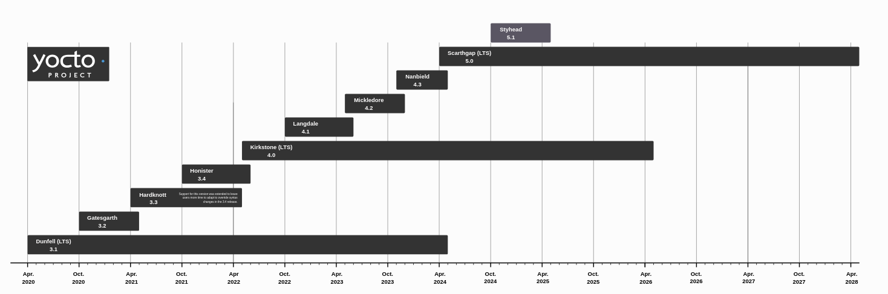
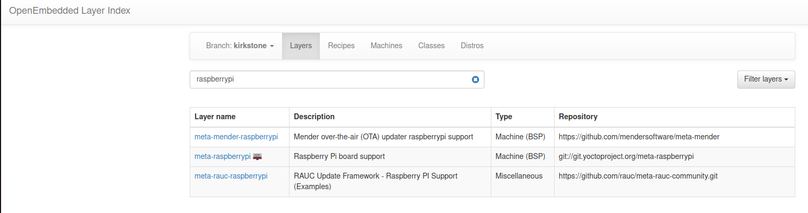
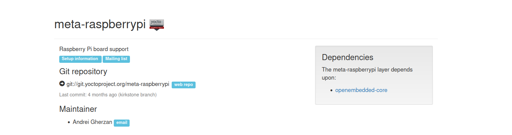

# Yocto Project for Raspberry Pi 3

Yocto-based build for Raspberry Pi 3 with SSH, WiFi support, Nano editor, Qt5 for GUI apps, RPiPlay for screen mirroring, audio support, a native Hello Bullet app, and a custom observability layer. Built with kernel 5.15.x and systemd, designed for embedded systems development and testing.

---

## Project Overview

This repository provides a Yocto-based build environment for Raspberry Pi 3, including essential packages such as:

- SSH for remote access.
- WiFi support for wireless connectivity.
- Nano editor for basic text editing.
- Qt5 for GUI application development.
- RPiPlay for screen mirroring.
- Audio playback/recording support (ALSA utilities).
- A native Hello Bullet sample application.
- A custom observability layer for system monitoring.

The project is built using **kernel version 5.15.x** and uses **systemd** as the init system, making it ideal for embedded systems development and testing.



---

## Steps of the Project

### 1. Pre-development Stage

#### 1 - Software Preparation

- Download Yocto Project extension for VS Code (**Yocto Project BitBake**).

  

#### 2- Install Dependencies

- Prepare **Environment** on the host machine(install dependencies):

  ```bash
  sudo apt install gawk wget git diffstat unzip texinfo gcc build-essential chrpath socat cpio python3 python3-pip python3-pexpect xz-utils debianutils iputils-ping python3-git python3-jinja2 libegl1-mesa libsdl1.2-dev python3-subunit mesa-common-dev zstd liblz4-tool file locales libacl1
  sudo locale-gen en_US.UTF-8
  ```


#### 3 - Choose YOCTO Release (Kirkstone Release)

The Yocto Project release process is predictable and consists of both major and minor (point) releases:

- **4.1 (“Langdale”)**
- **4.0 (“Kirkstone”)** (selected for this project)
- **3.4 (“Honister”)**

See all releases in this [link](https://wiki.yoctoproject.org/wiki/Releases).



---

#### 4 - Cloning Poky Kirkstone

To clone the Poky repository for the Kirkstone release, run the following command:

```bash
git clone -b kirkstone https://github.com/yoctoproject/poky
```
#### 5- Understanding Poky

Poky is the Yocto Project reference system and is composed of a collection of tools and metadata. It is platform-independent and performs cross-compiling, using the BitBake tool, OpenEmbedded Core, and a default set of metadata, as shown in the following figure. It provides the mechanism to build and combine thousands of distributed open source projects to form a fully customizable, complete, and coherent Linux software stack.

Poky's main objective is to provide all the features an embedded developer needs.


### 2. Development stage

#### Integrate BSP for raspberry pi
1- go to  (https://layers.openembedded.org/layerindex/branch/master/layers/)

2- search for raspberrypi , and select meta-raspberrypi


3- clone meta-raspberrypi from here

git clone -b kirkstone git://git.yoctoproject.org/meta-raspberrypi


4- add the layer to your yocto project bitbake-layers add-layer /PATH/TO/meta-raspberrypi


