# Yocto Project for Raspberry Pi 3

Yocto-based build for Raspberry Pi 3 with SSH, WiFi support, Nano editor, Qt5 for GUI apps, RPiPlay for screen mirroring, audio support, a native Hello Bullet app, and a custom observability layer. Built with kernel 5.15.x and systemd, designed for embedded systems development and testing.

---

## Project Overview

This repository provides a Yocto-based build environment for Raspberry Pi 3, including essential packages such as:

- SSH for remote access.
- WiFi support for wireless connectivity.
- Nano editor for basic text editing.
- Qt5 for GUI application development.
- RPiPlay for screen mirroring.
- Audio playback/recording support (ALSA utilities).
- A native Hello Bullet sample application.
- A custom observability layer for system monitoring.

The project is built using **kernel version 5.15.x** and uses **systemd** as the init system, making it ideal for embedded systems development and testing.


---

## Steps of the Project

### 1. Pre-development Stage

#### 1 - Software Preparation

- Download Yocto Project extension for VS Code (**Yocto Project BitBake**).

  

#### 2- Install Dependencies

- Prepare **Environment** on the host machine(install dependencies):

  ```bash
  sudo apt install gawk wget git diffstat unzip texinfo gcc build-essential chrpath socat cpio python3 python3-pip python3-pexpect xz-utils debianutils iputils-ping python3-git python3-jinja2 libegl1-mesa libsdl1.2-dev python3-subunit mesa-common-dev zstd liblz4-tool file locales libacl1
  sudo locale-gen en_US.UTF-8
  ```


#### 3 - Choose YOCTO Release (Kirkstone Release)

The Yocto Project release process is predictable and consists of both major and minor (point) releases:

- **4.1 (“Langdale”)**
- **4.0 (“Kirkstone”)** (selected for this project)
- **3.4 (“Honister”)**

See all releases in this [link](https://wiki.yoctoproject.org/wiki/Releases).


---

#### 4 - Cloning Poky Kirkstone

To clone the Poky repository for the Kirkstone release, run the following command:

```bash
git clone -b kirkstone https://github.com/yoctoproject/poky
```
#### 5- Understanding Poky

Poky is the Yocto Project reference system and is composed of a collection of tools and metadata. It is platform-independent and performs cross-compiling, using the BitBake tool, OpenEmbedded Core, and a default set of metadata, as shown in the following figure. It provides the mechanism to build and combine thousands of distributed open source projects to form a fully customizable, complete, and coherent Linux software stack.

Poky's main objective is to provide all the features an embedded developer needs.


### 2. Development stage

#### Integrate BSP for raspberry pi
1- go to  (https://layers.openembedded.org/layerindex/branch/master/layers/)

2- search for raspberrypi , and select meta-raspberrypi


3- clone meta-raspberrypi from here

git clone -b kirkstone git://git.yoctoproject.org/meta-raspberrypi


4- add the layer to your yocto project bitbake-layers add-layer /PATH/TO/meta-raspberrypi

#### Integrate Qt-5
1- go to  (https://layers.openembedded.org/layerindex/branch/master/layers/)

2- search for qt , and select meta-qt5


3- you will encounter this error
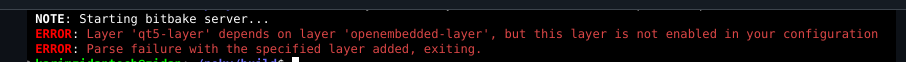

4- to solve this error you should integrate qt-5 dependencies

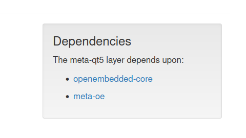

5- clone the openembedded-core
```bash
git clone -b kirkstone git://git.openembedded.org/openembedded-core
```
6- so now after cloning both you will find meta-oe layer inside openembedded-core layer by default


7- add meta-oe to the bblayers.conf

```bash
bitbake-layers add-layer /PATH/TO/meta-customRaspi/meta-qt5
```

### 3-Creating SW Layer meta-IVI Layer

1- create layer
```bash
bitbake create-layer meta-IVI
```

2- add meta-IVI to the bblayers.conf

```bash
bitbake add-layer meta-IVI
```
### 4-creating DISTRO Layer
1- create meta-info-distro layer
```bash
bitbake create-layer meta-info-distro
```

2- add meta-info-distro to the bblayers.conf

``` bash 
bitbake add-layer meta-info-distro
```

3 - go to meta-info-distro , and in conf directory , create distro directory

4- go to distro , create infotainment.conf

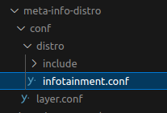

5 - add this at infotainment.conf to add the features (ex- systemd)
```bash
# Distibution Information.
DISTRO="infotainment"
DISTRO_NAME="Bullet-Infotainment"
DISTRO_VERSION="1.0"

MAINTAINER="sabryelsayedfarg@gmail.com"


# SDK Information.
SDK_VENDOR = "-bulletSDK"
SDK_VERSION = "${@d.getVar('DISTRO_VERSION').replace('snapshot-${METADATA_REVISION}', 'snapshot')}"
SDK_VERSION[vardepvalue] = "${SDK_VERSION}"

SDK_NAME = "${DISTRO}-${TCLIBC}-${SDKMACHINE}-${IMAGE_BASENAME}-${TUNE_PKGARCH}-${MACHINE}"
# Installation path --> can be changed to ${HOME}-${DISTRO}-${SDK_VERSION}
SDKPATHINSTALL = "/opt/${DISTRO}/${SDK_VERSION}" 

# Disribution Feature --> NOTE: used to add customize package (for package usage).

# infotainment --> INFOTAINMENT

INFOTAINMENT_DEFAULT_DISTRO_FEATURES = "largefile opengl ptest multiarch vulkan x11 bluez5 bluetooth wifi qt5"
INFOTAINMENT_DEFAULT_EXTRA_RDEPENDS = "packagegroup-core-boot"
INFOTAINMENT_DEFAULT_EXTRA_RRECOMMENDS = "kernel-module-af-packet"

# TODO: to be org.

DISTRO_FEATURES ?= "${DISTRO_FEATURES_DEFAULT} ${INFOTAINMENT_DEFAULT_DISTRO_FEATURES} userland"

require conf/distro/include/systemd.inc 

# prefered version for packages.
PREFERRED_VERSION_linux-yocto ?= "5.15%"
PREFERRED_VERSION_linux-yocto-rt ?= "5.15%"


# Build System configuration.

LOCALCONF_VERSION="2"

# add poky sanity bbclass
INHERIT += "poky-sanity"
```

6 - this distro has bluetooth,wifi,qt5 
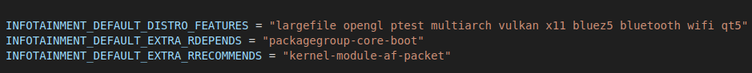

7 - add those to DISTRO_FEATURES
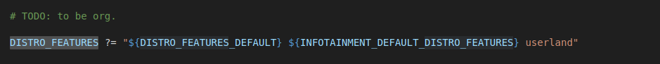

8- configure linux version 

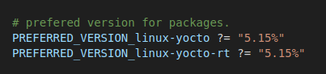


9-add systemd to the distro
- go to meta-info-distro/conf/distro
- create include directory
- create systemd.inc

 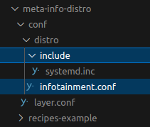 

 - at systemd.inc at this 
```bash
DISTRO_FEATURES:append = " systemd "
VIRTUAL-RUNTIME_init_manager = "systemd"
VIRTUAL-RUNTIME_initscript = "systemd-compat-units"
```

- go to infotainment.conf and include systemd.inc
  ```bash
  require conf/distro/include/systemd.inc
  ```


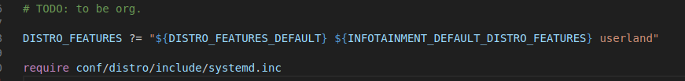

### 5-create your own image recipe (ivi-test-image)
 1- go to meta-IVI directory
 
 2- create receipes-core directory
 
 3- go to receipes-core 
 
 4- create images directory 
 
 5- create ivi-test-image.bb
 
 6- add this to ivi-test-image.bb

 ```bash
# include base image ----------->
# 1-poky
# 2- BSP layer

require recipes-core/images/rpi-test-image.bb


#2 - set of local variables
SUMMARY = " IVI Testing Image that include rpi func + helloworld package recipes "


inherit audio 

#3- customize the image 
IMAGE_INSTALL:append=" helloworld " 


# IMAGE_INSTALL ssh
# allow root access through ssh 
# access root through through ssh using empty password 
IMAGE_FEATURES:append=" debug-tweaks"
```
### 6- Access root through through ssh using empty password
1- go to ivi-test-image.bb

2- add debug-tweaks
```bash
# IMAGE_INSTALL ssh
# allow root access through ssh 
# access root through through ssh using empty password 
IMAGE_FEATURES:append=" debug-tweaks"
```

### 7-Inegrate ssh 
1-go to ivi-test-image.bb

2- add openssh
```bash
#3- customize the image 
IMAGE_INSTALL:append=" openssh "
```

### 8- Inegrate nano
1- go to meta-IVI directory

2- create receipes-editor

3- go to receipes-editor

4- create nano directory 

5- create nano receipe using this 

```bash
recipetool create -o nano_1.0.bb  https://git.savannah.gnu.org/git/nano.git
```
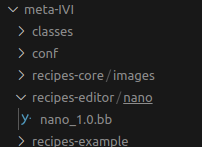

7- bitbake -c fetch nano  ---> here I only run specifc task of nano recipe (fetch)

8- bitbake -c unpack nano  ---> here I only run specifc task of nano recipe (unpack)

6- add do_configre and do_build to nano receipe
```bash
do_configure(){
    oe_runconf
}

do_build(){

    oe_runmake
}
```
7-assure to install autopoint ----> (sudo apt install autopoint)

8-run ./autogen.sh from sources in the "nano" directory,-------> to generate ./configure file to excute by oe_runconf
```bash
## here to get the source dir
bitbake -e nano | grep "^S="  ----> to the path of the source file of nano after downloading
## go to this path
run ./autogen.sh
```
9-run bitbake -c configure nano
10- run bitbake nano

### 9- integrate rpiplay
 1- go to meta-IVI directory
 
 2- create receipes-info and go to it
 
 3- create rpi-play directory
 
 4- create rpiplay.bb
 
```bash
recipetool create -o rpi-play_1.0.bb https://github.com/FD-/RPiPlay      
 3- create audio.bbclass
```

5-replace the content of rpi-play_1.0.bb to include some depencies
```bash
LICENSE = "Unknown"
LIC_FILES_CHKSUM = "file://LICENSE;md5=1ebbd3e34237af26da5dc08a4e440464 \
                    file://lib/llhttp/LICENSE-MIT;md5=f5e274d60596dd59be0a1d1b19af7978 \
                    file://lib/playfair/LICENSE.md;md5=c7cd308b6eee08392fda2faed557d79a"

SRC_URI = "git://github.com/FD-/RPiPlay;protocol=https;branch=master \
           file://0001_fix_include_dir_gstreamer.patch"           
# Modify these as desired
PV = "1.0+git${SRCPV}"
SRCREV = "64d0341ed3bef098c940c9ed0675948870a271f9"

S = "${WORKDIR}/git"


# NOTE: the following library dependencies are unknown, ignoring: brcmEGL plist bcm_host plist-2 brcmGLESv2 vchiq_arm openmaxil vcos
#       (this is based on recipes that have previously been built and packaged)
DEPENDS = " userland  avahi libplist mdns openssl glib-2.0 gst-devtools gstreamer1.0 gstreamer1.0-plugins-base gst-examples gstreamer1.0-libav gstreamer1.0-plugins-bad gstreamer1.0-plugins-good gstreamer1.0-plugins-ugly "

# TODO: check libplist and avahi is runtime and compile or runtime only.
RDEPENDS_${PN} = " avahi libplist gstreamer1.0-plugins-base gstreamer1.0-plugins-good "

inherit cmake pkgconfig

# Specify any options you want to pass to cmake using EXTRA_OECMAKE:
EXTRA_OECMAKE        = ""
TARGET_LDFLAGS      += "-Wl,--copy-dt-needed-entries"
EXTRA_OEMAKE:append  = 'LDFLAGS="${TARGET_LDFLAGS}"'
```
6 - create rpiplay direcotory that included this patch 0001_fix_include_dir_gstreamer.patch


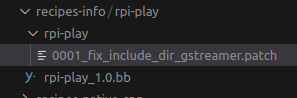

7 - go to 0001_fix_include_dir_gstreamer.patch and add this 
```bash
diff --git a/lib/logger.h b/lib/logger.h
old mode 100755
new mode 100644
diff --git a/renderers/CMakeLists.txt b/renderers/CMakeLists.txt
index e561250..76d9144 100755
--- a/renderers/CMakeLists.txt
+++ b/renderers/CMakeLists.txt
@@ -1,14 +1,7 @@
 cmake_minimum_required(VERSION 3.4.1)
 
-# Common Linux cflags
-if( UNIX AND NOT APPLE )
-    set( CMAKE_C_FLAGS "${CMAKE_C_FLAGS} -DSTANDALONE -D__STDC_CONSTANT_MACROS -D__STDC_LIMIT_MACROS -DTARGET_POSIX -D_LINUX -fPIC -DPIC -D_REENTRANT   -D_LARGEFILE64_SOURCE -D_FILE_OFFSET_BITS=64 -U_FORTIFY_SOURCE -Wall -g" )
-endif()
-
 # Common x86/x86_64 cflags
-if( CMAKE_SYSTEM_PROCESSOR MATCHES "(x86)|(X86)|(amd64)|(AMD64)" )
-    set( CMAKE_C_FLAGS "${CMAKE_C_FLAGS} -Ofast -march=native" )
-endif()
+
 
 # Always compile the dummy renderers
 set( RENDERER_FLAGS "${RENDERER_FLAGS} -DHAS_DUMMY_RENDERER" )
@@ -17,20 +10,20 @@ set( RENDERER_LINK_LIBS "" )
 set( RENDERER_INCLUDE_DIRS "" )
 
 # Check for availability of OpenMAX libraries on Raspberry Pi
-find_library( BRCM_GLES_V2 brcmGLESv2 HINTS ${CMAKE_SYSROOT}/opt/vc/lib/ )
-find_library( BRCM_EGL brcmEGL HINTS ${CMAKE_SYSROOT}/opt/vc/lib/ )
-find_library( OPENMAXIL openmaxil HINTS ${CMAKE_SYSROOT}/opt/vc/lib/ )
-find_library( BCM_HOST bcm_host HINTS ${CMAKE_SYSROOT}/opt/vc/lib/ )
-find_library( VCOS vcos HINTS ${CMAKE_SYSROOT}/opt/vc/lib/ )
-find_library( VCHIQ_ARM vchiq_arm HINTS ${CMAKE_SYSROOT}/opt/vc/lib/ )
+find_library( BRCM_GLES_V2 brcmGLESv2 HINTS ${CMAKE_SYSROOT}/usr/lib/ )
+find_library( BRCM_EGL brcmEGL HINTS ${CMAKE_SYSROOT}/usr/lib/ )
+find_library( OPENMAXIL openmaxil HINTS ${CMAKE_SYSROOT}/usr/lib/ )
+find_library( BCM_HOST bcm_host HINTS ${CMAKE_SYSROOT}/usr/lib/ )
+find_library( VCOS vcos HINTS ${CMAKE_SYSROOT}/usr/lib/ )
+find_library( VCHIQ_ARM vchiq_arm HINTS ${CMAKE_SYSROOT}/usr/lib/ )
 
 if( BRCM_GLES_V2 AND BRCM_EGL AND OPENMAXIL AND BCM_HOST AND VCOS AND VCHIQ_ARM )
   # We have OpenMAX libraries available! Use them!
   message( STATUS "Found OpenMAX libraries for Raspberry Pi" )
-  include_directories( ${CMAKE_SYSROOT}/opt/vc/include/ 
-  	${CMAKE_SYSROOT}/opt/vc/include/interface/vcos/pthreads 
-  	${CMAKE_SYSROOT}/opt/vc/include/interface/vmcs_host/linux 
-  	${CMAKE_SYSROOT}/opt/vc/src/hello_pi/libs/ilclient )
+  include_directories( ${CMAKE_SYSROOT}/usr/include/ 
+  	${CMAKE_SYSROOT}/usr/include/interface/vcos/pthreads 
+  	${CMAKE_SYSROOT}/usr/include/interface/vmcs_host/linux 
+  	${CMAKE_SYSROOT}/usr/src/hello_pi/libs/ilclient )
 
   option(BUILD_SHARED_LIBS "" OFF)
   add_subdirectory(fdk-aac EXCLUDE_FROM_ALL)
@@ -38,7 +31,7 @@ if( BRCM_GLES_V2 AND BRCM_EGL AND OPENMAXIL AND BCM_HOST AND VCOS AND VCHIQ_ARM
 
   set( CMAKE_C_FLAGS "${CMAKE_C_FLAGS} -DHAVE_LIBOPENMAX=2 -DOMX -DOMX_SKIP64BIT -ftree-vectorize -pipe -DUSE_EXTERNAL_OMX   -DHAVE_LIBBCM_HOST -DUSE_EXTERNAL_LIBBCM_HOST -DUSE_VCHIQ_ARM -Wno-psabi" )
   
-  aux_source_directory( ${CMAKE_SYSROOT}/opt/vc/src/hello_pi/libs/ilclient/ ilclient_src )
+  aux_source_directory( ${CMAKE_SYSROOT}/usr/src/hello_pi/libs/ilclient/ ilclient_src )
   set( DIR_SRCS ${ilclient_src} )
   add_library( ilclient STATIC ${DIR_SRCS} )
 
@@ -52,6 +45,22 @@ else()
   message( STATUS "OpenMAX libraries not found, skipping compilation of Raspberry Pi renderer" )
 endif()
 
+
+
+# use gstreamer.
+include_directories(	${CMAKE_SYSROOT}/usr/include/gstreamer-1.0/ 
+			${CMAKE_SYSROOT}/usr/include/glib-2.0/
+			${CMAKE_SYSROOT}/usr/include
+			${CMAKE_SYSROOT}/usr/lib/glib-2.0/include/
+			${CMAKE_SYSROOT}/usr/lib/gstreamer-1.0/include/
+			${CMAKE_SYSROOT}/usr/lib/
+		   )
+link_libraries ( ${CMAKE_SYSROOT}/usr/lib/ 
+		 ${CMAKE_SYSROOT}/lib/ 
+		 ${CMAKE_SYSROOT}/usr/lib/gstreamer-1.0 
+		 ${CMAKE_SYSROOT}/usr/lib/glib-2.0
+	       )
+
 # Check for availability of gstreamer
 find_package( PkgConfig )
 if( PKG_CONFIG_FOUND )
@@ -71,6 +80,11 @@ else()
   message( STATUS "pkg-config not found, skipping compilation of GStreamer renderer" )
 endif()
 
+
+
+
+
+
 # Create the renderers library and link against everything
 add_library( renderers STATIC ${RENDERER_SOURCES})
 target_link_libraries ( renderers ${RENDERER_LINK_LIBS} )
diff --git a/renderers/audio_renderer_gstreamer.c b/renderers/audio_renderer_gstreamer.c
index e461ac3..b7a284b 100644
--- a/renderers/audio_renderer_gstreamer.c
+++ b/renderers/audio_renderer_gstreamer.c
@@ -20,7 +20,7 @@
 #include "audio_renderer.h"
 #include <assert.h>
 #include <math.h>
-#include <gst/app/gstappsrc.h>
+#include <gstreamer-1.0/gst/app/gstappsrc.h>
 
 typedef struct audio_renderer_gstreamer_s {
     audio_renderer_t base;
diff --git a/renderers/video_renderer.h b/renderers/video_renderer.h
old mode 100755
new mode 100644
diff --git a/renderers/video_renderer_dummy.c b/renderers/video_renderer_dummy.c
old mode 100755
new mode 100644
diff --git a/renderers/video_renderer_gstreamer.c b/renderers/video_renderer_gstreamer.c
index dee6d50..7043e4b 100644
--- a/renderers/video_renderer_gstreamer.c
+++ b/renderers/video_renderer_gstreamer.c
@@ -19,8 +19,8 @@
 
 #include "video_renderer.h"
 #include <assert.h>
-#include <gst/gst.h>
-#include <gst/app/gstappsrc.h>
+#include <gstreamer-1.0/gst/gst.h>
+#include <gstreamer-1.0/gst/app/gstappsrc.h>
 #include <stdio.h>
 
 typedef struct video_renderer_gstreamer_s {

```

8 - if you encounter this error

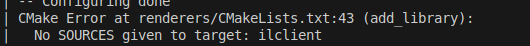


- to solve this error:
  1 - firstly make sure the ilclient source and header file is exist in userland directory
  go to (your_build_direcory_path/tmp-glibc/work/cortexa7t2hf-neon-vfpv4-oe-linux-gnueabi/userland/20220323-r0/git/host_applications/linux/apps/hello_pi/libs/ilclient)
  then run command ls to see the content of the directory
  you should find this directories
  ilclient.c  ilclient.h  ilcore.c  Makefile

  2 - go to (your_build_direcory_path/yocto_training/poky/my_rpi_3_build/tmp-glibc/work/cortexa7t2hf-neon-vfpv4-oe-linux-gnueabi/rpi-play/1.0+gitAUTOINC+64d0341ed3-r0/git/renderers)
  ex--> /home/sabry/yocto_training/poky/my_rpi_3_build/tmp-glibc/work/cortexa7t2hf-neon-vfpv4-oe-linux-gnueabi/rpi-play/1.0+gitAUTOINC+64d0341ed3-r0/git/renderers

  3 - open CMakeLists.txt

  4 - replace the content of CMakeLists.txt with this (make sure to modify paths with your actual path) with those modification :
  
      # Modifications Made
      
      ## 1. Define the Path for ilclient Source Files
      Added a variable `ILCLIENT_DIR` to define the path to the directory containing the ilclient source files:
      
      ```cmake
      set(ILCLIENT_DIR "/home/sabry/yocto_training/poky/my_rpi_3_build/tmp-glibc/work/cortexa7t2hf-neon-vfpv4-oe-linux-gnueabi/userland/20220323-r0/git/host_applications/linux/apps/hello_pi/libs/ilclient")
      ```
      
      ## 2. Specify the ilclient Source Files
      Created a variable `ILCLIENT_SOURCES` to include the necessary source files:
      
      ```cmake
      set(ILCLIENT_SOURCES ${ILCLIENT_DIR}/ilclient.c ${ILCLIENT_DIR}/ilcore.c)
      ```
      
      ## 3. Add the ilclient Library
      Used `add_library` to create the ilclient static library with the specified source files:
      
      ```cmake
      add_library(ilclient STATIC ${ILCLIENT_SOURCES})
      ```
      
      ## 4. Link the ilclient Library
      Updated the `target_link_libraries` command to link against the ilclient library after it has been defined:
      
      ```cmake
      target_link_libraries(ilclient ${BRCM_GLES_V2} ${BRCM_EGL} ${OPENMAXIL} ${BCM_HOST} ${VCOS} ${VCHIQ_ARM} pthread rt m)
      ```
  
  5 - The final CMakeLists.txt ant renderers dir will be like this
  
    ```bash
    cmake_minimum_required(VERSION 3.4.1)
    
    # Common x86/x86_64 cflags
    
    # Always compile the dummy renderers
    set(RENDERER_FLAGS "${RENDERER_FLAGS} -DHAS_DUMMY_RENDERER")
    set(RENDERER_SOURCES audio_renderer_dummy.c video_renderer_dummy.c)
    set(RENDERER_LINK_LIBS "")
    set(RENDERER_INCLUDE_DIRS "")
    
    # Check for availability of OpenMAX libraries on Raspberry Pi
    find_library(BRCM_GLES_V2 brcmGLESv2 HINTS ${CMAKE_SYSROOT}/usr/lib/)
    find_library(BRCM_EGL brcmEGL HINTS ${CMAKE_SYSROOT}/usr/lib/)
    find_library(OPENMAXIL openmaxil HINTS ${CMAKE_SYSROOT}/usr/lib/)
    find_library(BCM_HOST bcm_host HINTS ${CMAKE_SYSROOT}/usr/lib/)
    find_library(VCOS vcos HINTS ${CMAKE_SYSROOT}/usr/lib/)
    find_library(VCHIQ_ARM vchiq_arm HINTS ${CMAKE_SYSROOT}/usr/lib/)
    
    if(BRCM_GLES_V2 AND BRCM_EGL AND OPENMAXIL AND BCM_HOST AND VCOS AND VCHIQ_ARM)
      message(STATUS "Found OpenMAX libraries for Raspberry Pi")
      
      include_directories(${CMAKE_SYSROOT}/usr/include/ 
                          ${CMAKE_SYSROOT}/usr/include/interface/vcos/pthreads 
                          ${CMAKE_SYSROOT}/usr/include/interface/vmcs_host/linux 
                          ${CMAKE_SYSROOT}/usr/src/hello_pi/libs/ilclient
                          /home/sabry/yocto_training/poky/my_rpi_3_build/tmp-glibc/work/cortexa7t2hf-neon-vfpv4-oe-linux-gnueabi/userland/20220323-r0/git/host_applications/linux/apps/hello_pi/libs/ilclient) # Include path for ilclient
    
      option(BUILD_SHARED_LIBS "" OFF)
      add_subdirectory(fdk-aac EXCLUDE_FROM_ALL)
      add_subdirectory(h264-bitstream)
    
      set(CMAKE_C_FLAGS "${CMAKE_C_FLAGS} -DHAVE_LIBOPENMAX=2 -DOMX -DOMX_SKIP64BIT -ftree-vectorize -pipe -DUSE_EXTERNAL_OMX -DHAVE_LIBBCM_HOST -DUSE_EXTERNAL_LIBBCM_HOST -DUSE_VCHIQ_ARM -Wno-psabi")
    
      # Specify ilclient sources
      set(ILCLIENT_DIR "/home/sabry/yocto_training/poky/my_rpi_3_build/tmp-glibc/work/cortexa7t2hf-neon-vfpv4-oe-linux-gnueabi/userland/20220323-r0/git/host_applications/linux/apps/hello_pi/libs/ilclient")
      set(ILCLIENT_SOURCES ${ILCLIENT_DIR}/ilclient.c ${ILCLIENT_DIR}/ilcore.c)
    
      add_library(ilclient STATIC ${ILCLIENT_SOURCES})
    
      target_link_libraries(ilclient ${BRCM_GLES_V2} ${BRCM_EGL} ${OPENMAXIL} 
                             ${BCM_HOST} ${VCOS} ${VCHIQ_ARM} pthread rt m)
    
      set(RENDERER_FLAGS "${RENDERER_FLAGS} -DHAS_RPI_RENDERER")
      set(RENDERER_SOURCES ${RENDERER_SOURCES} audio_renderer_rpi.c video_renderer_rpi.c)
      set(RENDERER_LINK_LIBS ${RENDERER_LINK_LIBS} ilclient airplay fdk-aac h264-bitstream)
    else()
      message(STATUS "OpenMAX libraries not found, skipping compilation of Raspberry Pi renderer")
    endif()
    
    # Use GStreamer
    include_directories(${CMAKE_SYSROOT}/usr/include/gstreamer-1.0/ 
                        ${CMAKE_SYSROOT}/usr/include/glib-2.0/
                        ${CMAKE_SYSROOT}/usr/include
                        ${CMAKE_SYSROOT}/usr/lib/glib-2.0/include/
                        ${CMAKE_SYSROOT}/usr/lib/gstreamer-1.0/include/
                        ${CMAKE_SYSROOT}/usr/lib/)
    
    link_libraries(${CMAKE_SYSROOT}/usr/lib/ 
                   ${CMAKE_SYSROOT}/lib/ 
                   ${CMAKE_SYSROOT}/usr/lib/gstreamer-1.0 
                   ${CMAKE_SYSROOT}/usr/lib/glib-2.0)
    
    # Check for availability of GStreamer
    find_package(PkgConfig)
    if(PKG_CONFIG_FOUND)
      pkg_check_modules(GST gstreamer-1.0>=1.4
                            gstreamer-sdp-1.0>=1.4
                            gstreamer-video-1.0>=1.4
                            gstreamer-app-1.0>=1.4)
      if(GST_FOUND)
        set(RENDERER_FLAGS "${RENDERER_FLAGS} -DHAS_GSTREAMER_RENDERER")
        set(RENDERER_SOURCES ${RENDERER_SOURCES} audio_renderer_gstreamer.c video_renderer_gstreamer.c)
        set(RENDERER_LINK_LIBS ${RENDERER_LINK_LIBS} ${GST_LIBRARIES})
        set(RENDERER_INCLUDE_DIRS ${RENDERER_INCLUDE_DIRS} ${GST_INCLUDE_DIRS})
      else()
        message(STATUS "GStreamer not found, skipping compilation of GStreamer renderer")
      endif()
    else()
      message(STATUS "pkg-config not found, skipping compilation of GStreamer renderer")
    endif()
    
    # Create the renderers library and link against everything
    add_library(renderers STATIC ${RENDERER_SOURCES})
    target_link_libraries(renderers ${RENDERER_LINK_LIBS})
    target_include_directories(renderers PRIVATE ${RENDERER_INCLUDE_DIRS})
    
    # Pass the final renderer flags up to the parent scope so it knows which renderers will be available to use.
    set(RENDERER_FLAGS "${RENDERER_FLAGS}" PARENT_SCOPE)
  ```

### 10- integrate AUDIO
- note this is the view of the audio stack
  
  

 1- go to meta-IVI directory
 
 2- create classes directory and go to it
 
 3- create audio.bbclass
 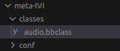
 
 4- add this to audio.bbclass

 
 ```bash
IMAGE_INSTALL:append = " pavucontrol pulseaudio pulseaudio-module-dbus-protocol pulseaudio-server \
                        pulseaudio-module-loopback pulseaudio-module-bluez5-device pulseaudio-module-bluez5-discover \
                        alsa-utils alsa-plugins bluez5 packagegroup-tools-bluetooth alsa-tools \
                        packagegroup-rpi-test rpi-play can-utils net-tools gstreamer1.0 alsa-topology-conf \
                        alsa-ucm-conf alsa-state alsa-lib qtbase-plugins libsocketcan qtquickcontrols \
                        qtquickcontrols2 qtgraphicaleffects qtmultimedia qtserialbus qtquicktimeline \
                        qtvirtualkeyboard i2c-tools hostapd iptables iproute2 iputils qtbase-examples \
                        gstreamer1.0-plugins-base gstreamer1.0-plugins-good \
                            "
```

 

   


 
 


